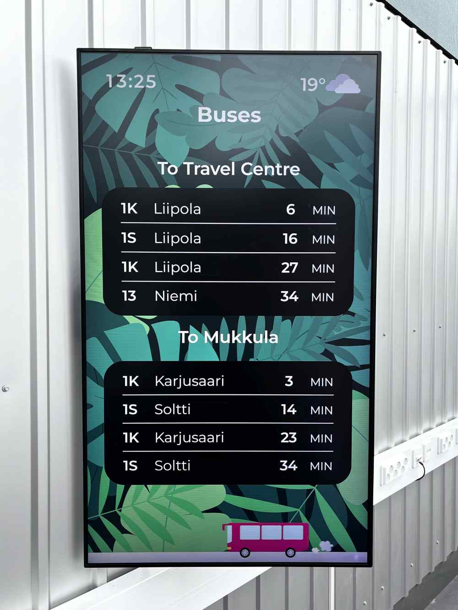

# Porfolio: Train and Bus Schedule Infoscreen Project

I interned as a software developer at LAB University of Applied Sciences in Summer 2024.
This project was created during the summer. It is an infoscreen monitor system for showing
bus and train schedules relevant to the location of the campus.

We had a team of three to work on the project. **My main responsibility was the backend and the admin panel.**
Another team member focused on the frontend client side. The third member worked on both the backend and the client,
and setting up the client device.

Photo of the finished product                                       | Screenshot with admin panel and another theme
:------------------------------------------------------------------:|:-----------------------------------------------:
  |  

## Portfolio structure

The [src](src) directory holds the entire source code for the project. It also contains the main README.

## Technologies I used
- TypeScript
- Node.js
    - Express
    - SQLite
    - TypeORM
    - Passport.js
- Vue
- Ubuntu server

TypeScript, Vue, Passport.js and TypeORM were new technologies for me.

## Highlights
- The project was successful, and the client was satisfied with the result
- We managed our time and resources effectively
- The end service is stable and robust, withstanding outages in public APIs for the time schedules

## What I learned and what I would do differently in the future
- As the project grew, the lack of test automation became increasingly noticeable. In future projects, I will prioritize implementing test automation from the start
- I found TypeScript's improvements beneficial and plan to utilize it more in future projects
- My team communication skills improved
- I learned the importance of spending more time on designing and defining interfaces early in the development process
