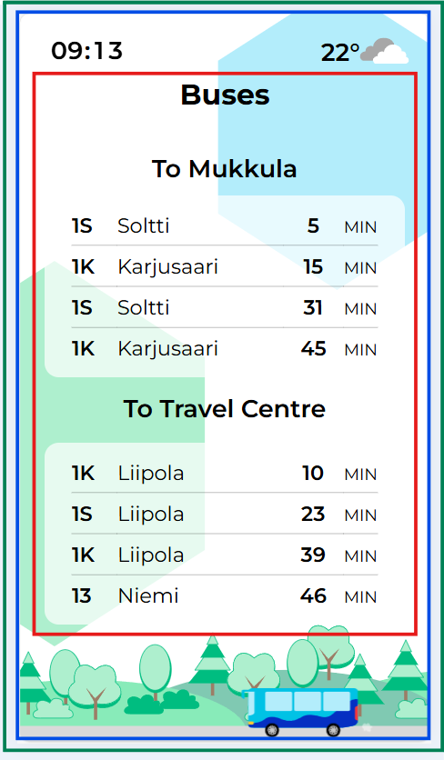

# JuBu client

This project was made using Vue 3 + Vite + Typescript as well as Vuex for state management.

This is a single page application with changing views, which are handled with Vue router.

The green square represents App.vue, which is the base of the application. In it are the view-changing logic, theme-changing logic and data fetching from the store.

The blue square is Background.vue. Within it are the clock, weather, the background elements and the animated vehicles on the bottom.

The red square represents the views, Buses.vue and Trains.vue, and even though it looks like it is inside Background.vue, that is not the case.

The shown data and the amount is controlled from the admin panel.